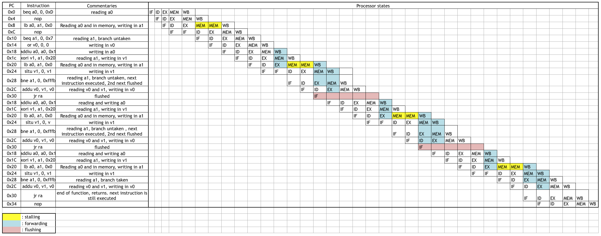

# Project 1
___

## 1) MIPS Instruction Set

> Use the attached cheat sheet (at the end of the assignment) in order to determine which
> MIPS instructions appear in the program. Determine the instruction format for each instruction.

> Determine the operands for each instruction. For registers determine both, the register
> number and the symbolic register name.

> There are conditional branches in the function. Determine to which instructions they
> branch.

| line | opcode |format| funct | MN     | rs  | rt  | rd  | imm    | traduction                                                        |
| ---: | ------:|:----:|:-----:|:-------|:---:|:---:|:---:|:------:|:---------------------------                                       |
| 0    | 4      |  I   |       | BEQ    | 4   | 0   |     | `OxD`  | **if (a0 = 0) then PC = PC + 4 + 4\*13 = 0x38**                   |
| 4    |        |      |       |        |     |     |     |        | **nop**                                                           |
| 8    | 32     |  I   |       | LB     | 4   | 5   |     | `0x0`  | **a1 = memory[a0 + 0] as a byte**                                 |
| c    |        |      |       |        |     |     |     |        | **nop**                                                           |
| 10   | 4      |  I   |       | BEQ    | 5   | 0   |     | `0x7`  | **if a1 = 0 then PC = PC + 4 + 4\*7 = 0x30**                      |
| 14   | 0      |  R   | 37    | OR     | 0   | 0   | 2   |        | **v0 = 0**                                                        |
| 18   | 9      |  I   |       | ADDIU  | 4   | 4   |     | `0x1`  | **a0 = a0 + 1**                                                   |
| 1c   | 14     |  I   |       | XORI   | 5   | 3   |     | `0x20` | **v1 = a1 XOR 0x20 : 6th byte flipped**                           |
| 20   | 32     |  I   |       | LB     | 4   | 5   |     | `0x0`  | **a1 = memory[a0] as a byte (we are reading a kind of tab)**      |
| 24   | 0      |  R   | 43    | SLTU   | 0   | 3   | 3   |        | **v1 = (0 < v1)  <=> (v1 != 0) as it is unsigned**                |
| 28   | 5      |  I   |       | BNE    | 5   | 0   |     |`0xFFFB`| **if a1 != 0 then branch at PC + 4 + 4\*(-5)  = 0x18**            |
| 2c   | 0      |  R   | 33    | ADDU   | 2   | 3   | 2   |        | **v0 = v0 + v1**                                                  |
| 30   | 0      |  R   | 8     | JR     | 31  |     |     |        | **Jump Register : PC = ra**                                       |
| 34   |        |      |       |        |     |     |     |        | **nop**                                                           |
| 38   | 0      |  R   | 8     | JR     | 31  |     |     |        | **Jump Register : PC = ra**                                       |
| 3c   | 9      |  R   |       | ADDIU  | 0   | 2   |     |`0xFFFF`| **v0 = 0xFFFF = -1**                                              |

> What is the function actually doing? What is its return value?

This function takes a string as argument and returns :
* -1 if the string is a null pointer
* The number of char different than a space in the string otherwise.

___
## 2) MIPS Tool Chain

> Write a C program matching the program from above.

```c
int f(char *s) {
    if(s == 0) return -1;
    char c = *s;
    if(c == 0) return 0;

    int r = 0;
    while(c != 0) {
        r += (c != ' ');
        c = *(++s);
    }
    return r;
}
```
> Compile the program using the MIPS compiler installed on the lab machines using the
> following command line:  
> `mips-linux-gnu-gcc -mips1 -c -g -o mips-prog.o <input-file>`

> Disassemble the compiled program (mips-prog.o) with the objdump tool using the
> following command line:  
> `mips-linux-gnu-objdump -d mips-prog.o`

> Compare the resulting assembly code obtained from the objdump tool with the code
> from above. Explain why the code looks so differently? The code contains many lw
> instructions that use the register s8. What is the purpose of register s8? What are these
> memory access instructions doing?

If we compile it without optimization. The assembly code is
quite different, much longer and most instructions are useless.
It uses register S8 which is the frame pointer. But here it is useless
as we know the size of the stack. Sp could have done the job, and here
sp = fp, so really it's useless. Moreover the code never uses other
register than v0 and it always store it's value in the stack (thanks to s8)
and load values from the stack.

> Try to change the compiler options (enable/disable optimizations using the option -O0,
> -O, or -O3) and see how this changes the code that you can see using the objdump
> tool.

With some optimization we get better results, and we no longer use S8.
With -O2 optimization we have the exact same code. And with -Os we get even a shorter code (but maybe less efficient).

___
## 3) MIPS Architecture


### 3.1 Program Flow

> Provide a full list of instructions until the function terminates by executing a jr instruction.

|  PC |  instruction    |   a0  |   a1  |  v0  |  v1  |  explaination                                                         |
|----:|:----------------|:-----:|:-----:|:----:|:----:|:-------------------------------------------------                     |
|0x0  |beq a0, 0, 0xD   |0x200  |0x0    | 0x0  | 0x0  |a0 != 0 so the branch is untaken                                       |
|0x4  |nop              |0x200  |0x0    | 0x0  | 0x0  |no change                                                              |
|0x8  |lb a0, a1, 0x0   |0x200  |0x0    | 0x0  | 0x0  |read from memory[0x200] to a1 the value arrives in the next instruction|
|0xc  |nop              |0x200  |0x61   | 0x0  | 0x0  |no change wait for loading                                             |
|0X10 |beq a1, 0, 0x7   |0x200  |0x61   | 0x0  | 0x0  |a1 != 0 so the branch is untaken                                       |
|0x14 |or v0, 0, 0      |0x200  |0x61   | 0x0  | 0x0  |v0 <= 0                                                                |
|0x18 |addiu a0, a0, 0x1|0x201  |0x61   | 0x0  | 0x0  |a0 <= a0 + 1                                                           |
|0x1c |xori v1, a1, 0x20|0x201  |0x61   | 0x0  |0x41  |v1 <= a1 ^ 0x20                                                        |
|0x20 |lb a0, a1, 0x0   |0x201  |0x61   | 0x0  | 0x41 |read from memory[0x201] to a1 the value arrives in the next instruction|
|0x24 |sltu v1, 0, v1   |0x201  |0x20   | 0x0  | 0x1  |v1 <= ( v1!= 0)                                                        |
|0x28 |bne a1, 0, 0xfffb|0x201  |0x20   | 0x0  | 0x1  |a1 != 0 so the branch is taken. the next instruction is still executed |
|0x2c |addu v0, v1, v0  |0x201  |0x20   | 0x1  | 0x1  |v0 <= v0 + v1 = 1                                                      |
|0x18 |addiu a0, a0, 0x1|0x202  |0x20   | 0x1  | 0x1  |a0 <= a0 + 1                                                           |
|0x1c |xori v1, a1, 0x20|0x202  |0x20   | 0x1  |0x0   |v1 <= a1 ^ 0x20                                                        |
|0x20 |lb a0, a1, 0x0   |0x202  |0x20   | 0x1  | 0x0  |read from memory[0x202] to a1 the value arrives in the next instruction|
|0x24 |sltu v1, 0, v1   |0x202  |0x62   | 0x1  | 0x0  |v1 <= ( v1!= 0)                                                        |
|0x28 |bne a1, 0, 0xfffb|0x202  |0x62   | 0x1  | 0x0  |a1 != 0 so the branch is taken. the next instruction is still executed |
|0x2c |addu v0, v1, v0  |0x202  |0x62   | 0x1  | 0x0  |v0 <= v0 + v1 = 1                                                      |
|0x18 |addiu a0, a0, 0x1|0x203  |0x62   | 0x1  | 0x0  |a0 <= a0 + 1                                                           |
|0x1c |xori v1, a1, 0x20|0x203  |0x62   | 0x1  |0x42  |v1 <= a1 ^ 0x20                                                        |
|0x20 |lb a0, a1, 0x0   |0x203  |0x62   | 0x1  | 0x42 |read from memory[0x203] to a1 the value arrives in the next instruction|
|0x24 |sltu v1, 0, v1   |0x203  |0x0    | 0x1  | 0x1  |v1 <= ( v1!= 0)                                                        |
|0x28 |bne a1, 0, 0xfffb|0x203  |0x0    | 0x1  | 0x1  |a1 == 0 so the branch is not taken                                     |
|0x2c |addu v0, v1, v0  |0x203  |0x0    | 0x2  | 0x1  |v0 <= v0 + v1 = 2                                                      |
|0x30 |jr ra            |0x203  |0x0    | 0x2  | 0x1  |end of function, returns. next instruction is still executed           |
|0x34 |nop              |0x203  |0x0    | 0x2  | 0x1  |nop                                                                    |

### 3.2 Pipiline Diagram

> Draw a pipeline diagram showing all the instructions executed by the function as determined
> above. Assume a processor implementation as described above. Highlight
> all forms of hazards that occur and graphically distinguish resolution mechanisms (e.g.,
> forwarding, stalls, flushing).



___
## 4) Processor design

### 4.1 Instruction Set Architecture

> Group instructions into binary formats, similar to the I-, J-, and R-format discussed for
> MIPS in the lecture. Illustrate the formats using figures in your report.

The first format is **R-format**, the 16-bits instruction is divided in 4 part of 4 bits :

|0...3 |4...7 |8...11|12...15|
|:----:|:----:|:----:|:----: |
|opcode|Rs    |R1    |R2     |

(There are 16 registers, so register id are on 4 bits.)

The second format is **M-format**, used for memory access. The opcode is now on 3 bits, and the immediate value is on 5 bits :

|0...2 |3...6 |7...10|11...15  |
|:---: |:----:|:----:|:-----:  |
|opcode|Rs    |Ra    |immediate|

And the last format is **I-format**. The opcode is on only 2 bits, and the immediate value is on 10 bits (register id are still on 4 bits) :

|0...1 |2...5 |6...15      |
|:--:  |:----:|:----------:|
|opcode|R     |immediate   |

> Describe each instruction of your processor. Explain what the instruction is doing, how it
> can be written in human readable form (assembly), and how it is encoded in binary form.

| Assembly code | Format | Opcode | Traduction                                  |
|:---:          |:---:   |:----   |:-----------------------                     |
|ADD            |R       |0000    |Rs <- R1 + R2                                |
|AND            |R       |0001    |Rs <- R1 & R2                                |
|XOR            |R       |0010    |Rs <- R1 ^ R2                                |
|JR             |R       |0011    |PC <- Rs                                     |
|LB             |M       |010     |Rs <- SE(Mem[Ra + SE(immediate)])        (*) |
|SB             |M       |011     |Mem[Ra + SE(immediate)] <- Rs[7:0]           |
|MV             |I       |10      |R <- SE(immediate)                           |
|BNN            |I       |11      |If R != 0, then PC = PC + 2 + 2 * immediate (**) |

*SE = Sign Extend.

** Instructions are on 16 bits, so PC should always be an even number.

> Provide a sequence of instructions in assembly form that allows to load the constant
> 65534 into a register using the instructions of your processor. Give a short explanation of
> each instruction and each intermediate result of your code.

In order to load 65534 (= 0xFFFE) into a register with those instructions, we can do :

```
MV R0 0x3FF
ADD R0 R0 R0
```

The first line will set R0 to -1 = 0x3FF (on 10 bits). It means that after this
instruction, R0 has 0xFFFF value due to sign extension. Then the second
instruction do : R0 <= -1 + -1 = -2 (0xFFFF + 0xFFFF = 0xFFFE).


> Translate the C-code from Question 1 to corresponding instructions of your processor.
> Assume that the input pointer is provided in the second register of your processor and that
> the result should be returned in the first register. The return address is similarly provided
> in register 15. Try to use the instructions of your processor as optimal as possible in order
> to minimize the number of instructions. There is no need to preserve any register values
> in your code, i.e., you can overwrite any register if needed.

Translation of C-code, we assume here that there is no pipeline in the processor yet.
```
00  BNN R1 2           //R1 = 0 -> return -1
02  MV  R0 0x3FF
04  JR  R15
06  MV  R0 0           //Initialization
08  MV  R3 0x20
0a  MV  R4 1
0c  LB  R2 R1 0
0e  BNN R2 1           //R2 = 0 -> return R0
10  JR  R15
12  XOR R2 R2 R3
14  ADD R1 R1 R4
16  BNN R2 1
18  BNN R4 0x3F9       //Go back to 0c instruction
1a  ADD R0 R0 R4
1c  BNN R4 0x3F7       //Go back to 0c instruction
```

### 4.2 Pipelining


> Which kinds of hazards (data, control, or structural) can you encounter for your processor?
> Explain under which circumstances these hazards occur. How are these hazards
> resolved?

There are 3 types of hazards :
* data hazard
* control hazard
* structural hazard

We will treat them one by one.

**Data hazard :**

This hazard occure when a data is not available when it is needed for the next instruction.
The textbook exemple is when an instruction needs the result of an ALU operation. For example :
```
00 ADD R2 R3 R4
02 ADD R0 R1 R2
```
In this code the result of the first instruction is needed as an operand for the second one.
Nevertheless, in a pipelined CPU the result of an ALU operation might not be written back in
the register file as soon as it is executed.

However in our pipelined CPU we only have three stages :
* Instruction Fetch (IF)
* Instruciton Decode (ID)
* Execute (EX)

The result of a ALU operation is written during the EX stage and is directly available. So this
result can be used for the next EX. This solves without any hazard the porblem of the codes like :
```
00 ADD R2 R3 R4
02 ADD R0 R1 R2
```

But the result of a EX instruction can be needed for a ID, typically :
```
00 ADD R0 R1 R2
02 BNN R0 0x08
```

Indeed, BNN (Branch Non Null) is done during the ID stage and thus needs the value of R0.
However this is not a hazard neither because we assume that the result of the ALU is
given so quickly that we have it for the ID directly.

As says the statement of the PR1 :

> Assume that the processor registers are written at the beginning of the EX stage and read
> at the end of the ID stage, i.e., values written in the EX stage are immediately available
> in the ID stage.

As a result, **a data hazard can only occure of there is a memory load**.
This hazard is solved by **stalling the IF and ID stages**.


**Control hazard :**

A control hazard occure when the next PC is not correct. This happens when a branch is
mispredicted.

In our CPU we only predict untaken branch. This means **this hazard occures when a branch
is taken**. As a result **we must flush the IF stage**.


**Structural hazard :**

This hazard happens when a ressource is needed by several instructions at the
same time. In our simple CPU, **This kind of hazard never occures**.


> Does your processor need forwarding (as discussed in the lecture) for the instructions
> in the EX stage? What about the conditional branch that is executed in the ID stage?
> Explain for both cases why it is needed or why it is not needed.

Our CPU **does not need a forwarding for the EX stage**. Indeed, the result of the previous EX stage
is directly written back in the register file and available.

As for the ID stage, we assumed that the result of the EX stage is written back
sufficiently quickly that it can be used in the same clock by the ID stage (for
example for a branch instruction). This means that **we don't need to implement
a forwarding for this CPU**.
