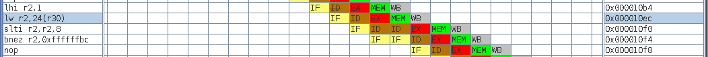
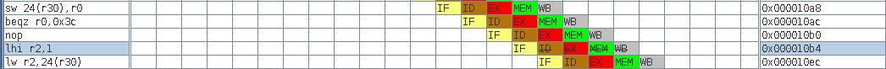

# Project 2
___

## 2) Warm Up

### 2.1 MIPS Tools

**Bonus Question :**

> Can you find the instructions that load the address of input (into a
> register? Probably it will be loaded into register v0 within
> the first for-loop of main.)

The instruction

```
mips-linux-gnu-objdump -t -j.data -j.text bin/insertion-sort.elf
```

shows that the address of `input` is `0x11210` :

```
00011210 g     O .data  00000190 input
```

Moreover, When we examine the assembly with the insruction :

```
mips-linux-gnu-objdump -d bin/insertion-sort.elf
```

we find this to load the address of input in `v0` :

```
10a8:       afc00018        sw      zero,24(s8)
10ac:       1000000f        b       10ec <main+0x54>
10b0:       00000000        nop
10b4:       3c020001        lui     v0,0x1
10b8:       8fc30018        lw      v1,24(s8)
10bc:       00031880        sll     v1,v1,0x2
[...]
10ec:       8fc20018        lw      v0,24(s8)
10f0:       28420008        slti    v0,v0,8
10f4:       1440ffef        bnez    v0,10b4 <main+0x1c>
10f8:       00000000        nop
```

| line |   instruction    |   v0   |   v1   | s8+[24]|   traduction                        |
|------|------------------|--------|--------|--------|-------------------------------------|
| 10a8 |  sw zero, 24(s8) | 0xxxxx | 0xxxxx | 0x0    |load 0x0 in s8                       |
| 10ac |  b 0x10ec        | 0xxxxx | 0xxxxx | 0x0    |branch 0x10ec                        |
| 10b0 |  nop             | 0xxxxx | 0xxxxx | 0x0    |nop                                  |
| 10ec |  lw v0, 24(s8)   | 0x0    | 0xxxxx | 0x0    |v0 = s8+[24]                         |
| 10f0 |  slti v0, v0, 8  | 0x1    | 0xxxxx | 0x0    |v0 = (v0<8)                          |
| 10f4 |  bnez v0, 0x10b4 | 0x1    | 0xxxxx | 0x0    |branch 0x10b4 if v0!=0 which is true |
| 10f8 |  nop             | 0x1    | 0xxxxx | 0x0    |nop                                  |
| 10b4 |  lui v0, 0x1     | 0x10000| 0xxxxx | 0x0    |v0 = 0x1 << 16                       |
| 10b8 |  lw v1, 24(s8)   | 0x10000| 0x0    | 0x0    |v1 = s8+[24]                         |
| 10bc |  sll v1, v1, 0x2 | 0x10000| 0x0    | 0x0    |v1 = v1 << 2                         |
| 10c0 |addiu v0, v0, 4624| 0x11210| 0x0    | 0x0    |v0 = v0 + 4624                       |

**At the end, `v0` contains `0x11210` witch is the address of `input`.**

___

## 3) Pipelining

> Can you tell from the pipeline diagram whether the simulated processor
> supports forwarding?

The instructions are the following :

```
addiu r29, r29, -32
sw    28(r29), r31
```

the `sw 28(r29), r31` instruction needs the value of `r29` beacause it stores `r31`
in the address `mem[r29 + 28]`. But `r29` is modified by `addiu r29, r29, -32`. Hence,
the result of `r29` is forwarded from the ALU directly.

> Can you identify a special case for the lw instruction?

For the `lw` instruction, there is a memory access that cannot be forwarded. As a
result, there is systematically a stalling after a `lw` if the loaded value is used.

Here is the screenshot :



> When you look at the pipeline diagram, you will see quite a few instructions that do not
> complete their execution. When you look at the pipeline diagram, you will see quite
> a few instructions that do not complete their execution. Explain why the respective
> instruction did not finish its execution

We can see a flush there :



**explaination :**

When `beqz` is in the EX stage, the branch is taken but two instructions are
already in the pipeline. The first instruction after the branch is always
executed (that's why it is a `nop`). The second instruction is flushed if the
branch is taken.

> Have a close look at the way branches and jumps are handled. Can you find
> a difference with regard to the way these instructions are handled
> in comparison to the lecture?

In the processor as in the course, the new program counter is loaded when the
jump (or branch) is in the EX stage. Nevertheless, in the course, the two
folowing instructions that are in IF and ID stages are flushed if the branch
is taken. In this processor, **only the second is flushed** and the first is
still executed. That's why we can find a `nop` after branches and jumps.
